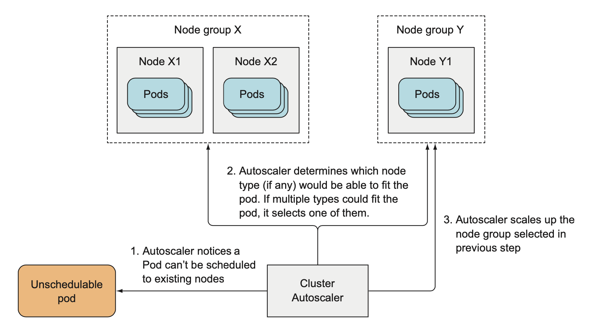

# 15. 파드와 클러스터 노드의 오토스케일링

갑작스러운 CPU 사용량 증가 혹은 다른 메트릭 증가로 인해 수동으로 스케일링이 불가능한 경우 쿠버네티스가 자동으로 확장이 가능  

## 1. 수평적 파드 오토스케일링

컨트롤러가 파드의 레플리카 수를 자동으로 조장하는 것

### 1.1 오토스케일링 프로세스 이해

- 확장 가능한 리소스 오브젝트에서 관리하는 모든 파드의 메트릭을 가져옴
- 메트릭을 지정한 목표 값과 같거나 가깝도록 하기 위해 필요한 파드 수를 계산
- 확장 가능한 리소스의 replicas 필드를 갱신

#### 파드 메트릭 얻기

cAdvisor 에이전트에 의해 수집된 파드와 노드의 메트릭은 힙스터에 의해 집계  
HorizontalPodAutoscaler는 REST를 통해 힙스터에 질의해 모든 파드의 메트릭을 가져옴  

#### 필요한 파드 수 계산

각 메트릭별 필요한 파드의 수를 정함 : (전체 파드 메트릭 값의 합)/(목표 메트릭 사용량)  
여러개의 메트릭을 고려해야 할 경우 각 메트릭별 필요 파드 수를 구한 뒤 가장 높은 값을 채택

#### 스케일링된 리소스의 레플리카 수 갱신

오토스케일러 컨트롤러는 스케일 대상 리소스의 replicas 필드를 scale sub-resource를 통해 변경  
오토스케일러가 리소스의 세부 사항을 알 필요가 없도록 해줌

#### 전체 오토스케일링 과정 이해

오토스케일링 과정의 각 구성 요소는 다른 구성 요소에서 주기적으로 메트릭 정보를 가져옴  
이러한 과정으로 인해 메트릭 데이터가 전파돼 재조정 작업이 수행되기까지는 시간이 걸림 

### 1.2 CPU 사용률 기반 스케일링

CPU 사용량은 대개 불안정하므로 전체 용량을 사용하기 전에 스케일 아웃을 수행하는 것이 좋음  
항상 **목표 CPU 사용량은 90% 이상으로 설정하면 안됨**  
오토스케일러는 파드의 CPU 사용률 결정시 파드가 보장받은 CPU 사용량만 중요  
오토스케일링이 필요한 파드는 **LimitRange 오브젝트를 통해 CPU 요청을 설정해야 함**

#### CPU 사용량을 기반으로 HorizontalPodAutoscaler 생성

```bash
$ cat deployment.yaml
apiVersion: apps/v1
kind: Deployment
metadata:
  name: kubia
spec:
  replicas: 3
  template:
    metadata:
      name: kubia
      labels:
        app: kubia
    spec:
      containers:
      - image: luksa/kubia:v1
        name: nodejs
        resources:
          requests:
            cpu: 100m
  selector:
    matchLabels:
      app: kubia

$ kubectl autoscale deployment kubia --cpu-percent=30 --min=1 --max=5  # 최소 및 최대 레플리카 수 지정 가능
horizontalpodautoscaler.autoscaling/kubia autoscaled
$ kubectl get hpa.v2beta1.autoscaling kubia -o yaml
apiVersion: autoscaling/v2beta1
kind: HorizontalPodAutoscaler
metadata:
  creationTimestamp: "2021-04-18T17:03:26Z"
...
	name: kubia
...
spec:
  maxReplicas: 5
  metrics:
  - resource:
      name: cpu
      targetAverageUtilization: 30
    type: Resource
  minReplicas: 1
  scaleTargetRef:  # 오토스케일러가 제어할 목표 리소스
    apiVersion: apps/v1
    kind: Deployment
    name: kubia
status:  # 오토스케일러의 현재 상태
  conditions:
...
  currentMetrics: null
  currentReplicas: 3
  desiredReplicas: 0
```

#### 최초 오토 리스케일 이벤트 보기

```bash
$ kubectl get hpa
NAME    REFERENCE          TARGETS         MINPODS   MAXPODS   REPLICAS   AGE
kubia   Deployment/kubia   <unknown>/30%   1         5         3          5m37s
```

- 메트릭을 수집해오는 과정까지 오토스케일러는 시간이 걸리는데, 이때 HPA 리소스를 확인하면 TARGETS가 <unknown>으로 표시됨

**실습 중 오류 발생**

```bash
$ kubectl describe hpa
Name:                                                  kubia
Namespace:                                             default
Labels:                                                <none>
Annotations:                                           <none>
CreationTimestamp:                                     Mon, 19 Apr 2021 02:03:26 +0900
Reference:                                             Deployment/kubia
Metrics:                                               ( current / target )
  resource cpu on pods  (as a percentage of request):  <unknown> / 30%
Min replicas:                                          1
Max replicas:                                          5
Deployment pods:                                       3 current / 0 desired
Conditions:
  Type           Status  Reason                   Message
  ----           ------  ------                   -------
  AbleToScale    True    SucceededGetScale        the HPA controller was able to get the target's current scale
  ScalingActive  False   FailedGetResourceMetric  the HPA was unable to compute the replica count: failed to get cpu utilization: unable to get metrics for resource cpu: unable to fetch metrics from resource metrics API: the server could not find the requested resource (get pods.metrics.k8s.io)
Events:
  Type     Reason                        Age                     From                       Message
  ----     ------                        ----                    ----                       -------
  Warning  FailedComputeMetricsReplicas  6m6s (x12 over 8m54s)   horizontal-pod-autoscaler  invalid metrics (1 invalid out of 1), first error is: failed to get cpu utilization: unable to get metrics for resource cpu: unable to fetch metrics from resource metrics API: the server could not find the requested resource (get pods.metrics.k8s.io)
  Warning  FailedGetResourceMetric       3m50s (x21 over 8m54s)  horizontal-pod-autoscaler  failed to get cpu utilization: unable to get metrics for resource cpu: unable to fetch metrics from resource metrics API: the server could not find the requested resource (get pods.metrics.k8s.io)

$ kubectl get hpa
NAME    REFERENCE          TARGETS         MINPODS   MAXPODS   REPLICAS   AGE
kubia   Deployment/kubia   <unknown>/30%   1         5         3          29m
$ kubectl get deployment
NAME    READY   UP-TO-DATE   AVAILABLE   AGE
kubia   3/3     3            3           35m
```

- 구글링
  - https://github.com/kubernetes/minikube/issues/9370#issuecomment-731306900

#### 스케일 업 일으키기

```bash
$ kubectl expose deployment kubia --port=80 --target-port=8080
service/kubia exposed
```

<br>

## 2. 수직적 파드 오토스케일링

결론 : 아직 음슴

<br>

## 3. 수평적 클러스터 노드 확장

모든 노드가 한계에 도달한 경우 수평적 파드 오토스케일러는 추가 파드 인스턴스를 생성할 수 없음  
이런경우 해결 방법은

- 기존 파드 중 몇 개를 삭제
- 파드가 사용하는 자원을 줄이거나 아니면 새로운 노드 추가
  - 쿠버네티스 클러스터가 온프레미스 환경에서 운영중일 때 새로운 물리 머신을 클러스터에 추가해야 함  
  - 클라우드 인프라스트럭처에서 운영중인 경우 쉽게 가능

쿠버네티스는 추가적인 노드가 필요함을 탐지하면 가능한 빠르게 클라우드 제공자에게 요청하는 기능이 있음 - 클러스터 오토 스케일러가 수행

### 3.1 클러스터 오토스케일러 소개

#### 클라우드 인프라스트럭처에 추가 노드 요청

새 파드가 생성된 후 스케줄링할 노드가 없는 경우 클러스터 오토스케일러는 클라우드 제공자에 추가 노드 시작 요청  
이때 파드가 실행될 수 있는 노드 유형을 지정해서 요청해야 함  
클러스터 오토스케일러는 사용 가능한 노드 그룹을 검사해 파드를 수용 가능한 노드 유형이 하나라도 있는 경우 해당 노드 그룹의 크기를 증가시킴  
새 노드가 시작되면, 해당 노드의 kubelet이 API 서버에 접속해 노드 리소스를 만들어 노드를 등록



#### 노드 종료

클러스터 오톸스케일러는 모든 노드에 요청된 CPU와 메모리를 모니터링  
특정 노드에서 실행중인 모든 파드의 CPU, 메모리 요청이 50% 미만이면 해당 노드는 필요하지 않은 것으로 간주  
이때 시스템 파드가 노드에서 실행 중이거나 관리되지 않는 파드나 로컬 저장소를 가진 파드가 실행되는 경우에 해당 노드는 종료될 수 없음

종료할 노드로 선택되면

1. 해당 노드는 스케줄링 불가하다는 표시
2. 노드에서 실행 중인 모든 파드를 제거

### 질문 

- 관리되지 않는 파드는 뭘까여??

### 3.2 클러스터 오토스케일러 활성화

- 구글 쿠버네티스 엔진
- 구글 컴퓨터 엔진
- 아마존 웹 서비스
- 마이크로소프트 애저

각 클라우드 제공자에 따라 오토스케일러 활성화 방법을 확인해야 함

### 3.3 클러스터 스케일 다운 동안에 서비스 중단 제한

예기치 않게 노드의 이슈로 파드가 사용 불가상태가 될 때는 어쩔 수 없지만 클러스터 오토스케일러나 시스템 관리자로 인해 노드 종료시에 파드가 제공하는 서비스가 중단되지 않게 할 수 있음   
**PodDistruptionBudget**리소스를 만들어 스케일 다운 등의 작업을 수행할 경우에도 최소 파드 개수가 유지되도록 함

파드 레이블 셀렉터와 항상 사용 가능해야 하는 파드의 최소 개수 혹은 파드의 최대 개수를 정의할 수 있음   
이 리소스가 존재하는 동안 클러스터 오토스케일러와 `kubectl drain` 명령 모두 이 조건을 준수함