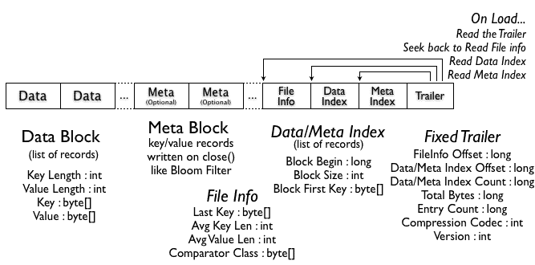

# HBase 아키텍처

## 목차

1. [Write Ahead Log (WAL)](#Write-Ahead-Log-WAL)

---

## 개요

> HBase를 매일 이리저리 사용하면서도 자세히 모르는 것 같아서 현타가 와버렸다.ㅠㅠ
> 기억의 파편들에 리서치로 뼈와 살을 붙여 제대로 HBase를 이해해보자

   

## Write Ahead Log (WAL)

리전 서버는 디스크에 파일이 너무 많이 생성되지 않도록 메모리(memstore)에 충분히 보유한다. 메모리에 데이터를 가지므로 서버에 이슈가 생길 경우 소실 가능성이 있다. 이러한 문제를 해결하기 위해 WAL을 사용한다.

HBase는 모든 변경 사항들을 로그에 쓰고, 연산이 성공했을 때만 클라이언트에 성공했음을 반환한다. 서버가 중지되면 WAL을 사용하여 서버가 중지되기 전까지의 상태 [변경 사항을 재현](#변경-사항-복구)할 수 있다.

 

## StoreFile ([HFile](#http://hbase.apache.org/book.html#hfile))

실제 저장 파일을 구현하는 클래스로, HBase의 데이터를 효율적으로 저장한다는 단 하나의 명확한 목표를 달성하기 위한 클래스
https://github.com/apache/hbase/blob/6cdc4b1f0574cc424480ec2f2e3129f280fa8472/hbase-server/src/main/java/org/apache/hadoop/hbase/io/hfile/HFile.java

위 그림은 HFile의 구조인데 File Info, Trailer 외에는 모두 옵셔널한 블록이다. 하지만 Data 블록는 실질적으로 저장되는 데이터를 담기 때문에 거의 대부분 하나의 데이터 블록은 존재할 것이다.
Data 블록은 key (로우 키 길이, 로우키, 컬럼 패밀리 길이, ...), value 로 이루어져 있다. 키에는 많은 정보가 담겨져 있으므로 불필요하기 긴 이름의 키 설정을 지양해야 한다.

 

## 변경 사항 복구

리전이 열리면 'recovered.edits' 디렉터리가 있는지 확인한다. 디렉토리가 존재하면 HBase 변경사항이 저장된 내부의 파일들을 읽어 memstore에 저장한다. 파일들은 일련번호가 포함된 이름순으로 정렬되어 있으므로 순서대로 복구할 수 있다. 이 때 일련번호가 디스크에 저장된 저장 파일(HFile)의 일련번호와 같거나 작으면 이미 모든 내용이 반영된것으로 판단하고 무시한다.
모든 edit 파일을 체크하면 memstore의 내용들은 디스크(HFile)로 저장하도록 강제 flush를 하고, edit 파일들은 삭제한다.

 

## Zookeeper와 HBase (WIP)

http://hbase.apache.org/book.html#trouble.namenode.hbase.objects