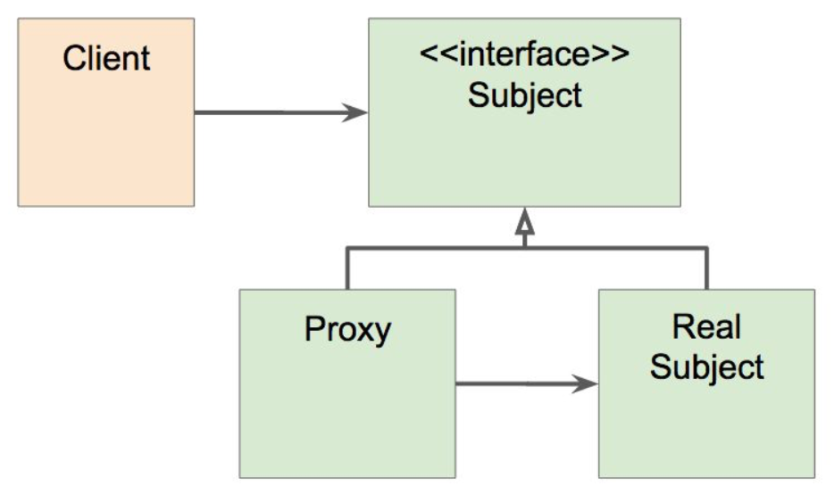

# 스프링 프레임워크 핵심기술

> **url** : https://www.inflearn.com/course/spring-framework_core/dashboard
> **강사** : 백기선
>
> 스프링을 잘 모르면서 사용하다보니 이대로는 안되겠다 하는 시점들이 자주 찾아온다ㅠㅠ
> 더는 미룰 수 없어서 수강하는 스프링 프레임워크 핵심기술!


# 0. 소개

#### 스프링이란?

* 소규모 애플리케이션 또는 기업용 애플리케이션을 자바로 개발하는데 있어 유용하고 편리한 기능을 제공하는 프레임워크

### 디자인 철학

* 모든 선택은 개발자의 몫
* 다양한 관점을 지향하여 유연성을 높임
* 하위 호환성을 지킴
* API를 신중하게 설계
* 높은 수준의 코드 지향

<br>

# 1. IoC 컨테이너와 빈

## 1부. 스프링 IoC 컨테이너와 빈

### IoC란?

> 의존 관계 주입 ( Inversion of Control )
> 한 클래스에서 사용할 의존 객체를 생성자를 사용해 직접 만들어서 사용하는 것이 아니라, 주입받아서 사용하는 방법


### IoC 컨테이너

* BeanFactory interface가 가장 핵심
* 어플리케이션 컴포넌트의 중앙 저장소
* 빈 설정 소스로 부터 빈 정의를 읽어들이고, 빈을 구성하고 제공


### Bean

* 스프링 IoC 컨테이너가 관리하는 객체

* 장점

  * 의존성 관리
  * 스코프
    * 싱글톤 : 하나만 만들어서
    * 프로토타입 : 매번 다른 객체
  * 라이프사이클 인터페이스

  

#### ApplicationContext

실질적으로 우리가 가장 많이 사용하게 될 BeanFactory
BeanFactory를 상속하여 기본적인 BeanFactory의 기능을 수행하면서 추가적인 기능들을 제공

* BeanFactory
* 메세지 소스 처리 기능 (i18n)
* 이벤트 발행 기능
* 리소스 로딩 기능
* ...

<br>

## 2부. ApplicationContext와 다양한 빈 설정 방법

### Bean을 정의하는 방법은 어노테이션 외에도 xml 파일로 가능

application.xml

```xml
<bean id="소문자 시작, camelCase" class="해당 클라스 package.ClassName">
  <property name="상속 받을 클래스 내부에 인스턴스 변수 명" ref="다른 bean id" />
</bean>
```

application.java

```java
public class Application {
  public static void main(String[] args) {
    ApplicationContext context = new ClassPathXmlApplicationContext("application.xml");
    String[] beanDefinitionNames = context.getBeanDefinitionNames();
    System.out.println(Arrays.toString(beanDefinitionNames));
    BookService bookService = (BookService) context.getBean("bookService");
  }
}
```

이러한 방법은 매우 불편하다!

```xml
<context:component-scan base-package="스프링 컨테이너가 관리할 package"/>
```

근데 java로 컨피그 파일을 만들 수는 없을까?

```java
@Configuration
//@ComponentScan(basePackageClasses = Application.class)  
// 이 클래스가 위치한 곳부터 component 스캐닝을 해라
// ComponentScan 어노테이션을 달면 아래의 bean 정의는 모두 삭제해도 됨
public class ApplicationConfig {
    @Bean
    public BookRepository bookRepository() {
        return new BookRepository();
    }

    @Bean
    public BookService bookService(BookRepository bookRepository) {
        return new BookService(bookRepository);
    }
}

@SpringBootApplication
public class Application {
    public static void main(String[] args) {
        ApplicationContext context = new AnnotationConfigApplicationContext(ApplicationConfig.class);
        String[] beanDefinitionNames = context.getBeanDefinitionNames();
        System.out.println(Arrays.toString(beanDefinitionNames));
        BookService bookService = (BookService) context.getBean("bookService");

        System.out.println(bookService.bookRepository != null);
    }
}

```

SpringBoot를 사용한다면 이러한 bean 정의를 모두 생략할 수 있다.

```java
// ComponentScan 어노테이션을 포함하는 SpringBootApplication 어노테이션이 모든 Bean 객체를 생성해줌!
@SpringBootApplication
public class Application {
    public static void main(String[] args) {
    }
}
```

<br>

## 3부. @Autowired

> 필요한 의존 객체의 "타입"에 해당하는 빈을 찾아 주입한다.

### @Autowired

* required: default - true (못 찾으면 구동 실패)

### 사용 가능한 위치

* constructor (스프링 4.3 이후부터 생략 가능)
  * 빈을 만들 때 생성자에 parameter로 넘겨지는 bean이 존재하지 않으면 안됨
* setter
* field

### 경우의 수 (use case)

* 해당 타입의 빈이 없는 경우
* 해당 타입의 빈이 한 개인 경우
* 해당 타입의 빈이 여러 개인 경우
  * 빈 이름으로 시도
    * 같은 이름의 빈 찾으면 해당 빈 사용
    * 같은 이름 못 찾으면 실패

### 같은 타입의 빈이 여러개 일 때

* **@Primary**
  * 그나마 가장 추천!
* 해당 타입의 빈 모두 주입
  * `List<BookRepository> bookRepositoies;`
* @Qualifier (빈 이름으로 주입)
  * TypeSafe 하지 않으므로 @Primary 어노테이션을 더 추천

### 동작 원리

* Bean LifeCycle
  * Bean initialization
* BeanPostProcessor
  Bean을 만든 이후에 Bean initialization 라는 라이프사이클이 있음
  Bean Initialization 이전/이후에 부가적인 작업을 하기 위한 Life Cycle Callback이 있는데 그것이 BeanPostProcessor
  * @PostConstruct 어노테이션
    라이프사이클 콜백, InitializingBean's after PropertiesSet
    implements ApplicationRunner 보다 더 빠르게 실행됨 (어플리케이션 구동 중에 실행)
    * <-> ApplicationRunner
      ApplicationRunner는 Spring이 모든 Initialization이 끝나고 어플리케이션 구동이 끝난 다음에 실행
  * 새로 만든 인스턴스를 수정할 수 있는 라이프 사이클 인터페이스
  * Initialization 후에 처리 (아래의 Spring Lifecycle 12번 단계에서 해줌)
  * BeanFactory가 내부의 BeanPostProcessor를 찾음
* AutowiredAnnotationBeanPostProcessor
  * 스프링이 제공하는 @Autowired와 @Value 어노테이션 그리고 JSR-330의 @Inject 어노테이션을 지원하는 어노테이션 처리기
  * Initialization 전에 처리 (아래의 Spring Lifecycle 11번 단계에서 해줌)
  * https://docs.spring.io/spring-framework/docs/current/javadoc-api/org/springframework/beans/factory/annotation/AutowiredAnnotationBeanPostProcessor.html

### [BeanFactory Interface](https://docs.spring.io/spring-framework/docs/current/javadoc-api/org/springframework/beans/factory/BeanFactory.html)

> Bean factory implementations should support the standard bean lifecycle interfaces as far as possible. The full set of initialization methods and their standard order is:
>
> 1. BeanNameAware's `setBeanName`
> 2. BeanClassLoaderAware's `setBeanClassLoader`
> 3. BeanFactoryAware's `setBeanFactory`
> 4. EnvironmentAware's `setEnvironment`
> 5. EmbeddedValueResolverAware's `setEmbeddedValueResolver`
> 6. ResourceLoaderAware's `setResourceLoader` (only applicable when running in an application context)
> 7. ApplicationEventPublisherAware's `setApplicationEventPublisher` (only applicable when running in an application context)
> 8. MessageSourceAware's `setMessageSource` (only applicable when running in an application context)
> 9. ApplicationContextAware's `setApplicationContext` (only applicable when running in an application context)
> 10. ServletContextAware's `setServletContext` (only applicable when running in a web application context)
> 11. `postProcessBeforeInitialization` methods of BeanPostProcessors
> 12. InitializingBean's `afterPropertiesSet`
> 13. a custom init-method definition
> 14. `postProcessAfterInitialization` methods of BeanPostProcessors
>
> On shutdown of a bean factory, the following lifecycle methods apply:
>
> 1. `postProcessBeforeDestruction` methods of DestructionAwareBeanPostProcessors
> 2. DisposableBean's `destroy`
> 3. a custom destroy-method definition

<br>

## 4부. @Component와 Component Scan

### 컨포넌트 스캔 주요 기능

- **스캔 위치 설정**
  
  - scanBasePackages
  - scanBasePackageClasses
  - SpringBoot는 SpringBootApplication 어노테이션안에 존재함
- **필터**
  어떤 애노테이션을 스캔 할지 또는 하지 않을지

  ```java
  @ComponentScan(excludeFilters = { 
    @Filter(type = FilterType.CUSTOM, classes = TypeExcludeFilter.class),
  	@Filter(type = FilterType.CUSTOM, classes = AutoConfigurationExcludeFilter.class) 
  })
  ```
  

### Component Scan의 대상들 - @Component

- @Repository

- @Service

- @Controller

-  @Configuration


### 동작 원리

- @ComponentScan은 스캔할 패키지와 애노테이션에 대한 정보
- 실제 스캐닝은 ConfigurationClassPostProcessor라는 BeanFactoryPostProcessor에 의해 처리 됨. 
  -  다른 모든 빈들을 만들기 이전에 실행

### Functional을 사용한 빈 등록

Spring5 이상에서 등장한 방법
Reflection, Proxy 같은 기법을 사용하지 않으므로 구동 성능에 영향을 주지 않음
모든 Component를 등록하는건 엄청난 설정 파일을 만들게 될 것이기 때문에 대체는 어려움
다른 패키지의 Bean을 등록하는 경우를 대체하기에는 나쁘지 않음


```java
public static void main(String[] args) {
        new SpringApplicationBuilder()
          .sources(Demospring51Application.class)
          .initializers(
          (ApplicationContextInitializer<GenericApplicationContext>) applicationContext -> {
            applicationContext.registerBean(MyBean.class); 
          })
          .run(args);
}
```

<br>

## 5부. Bean의 Scope

### Scope

* Singleton
* Prototype : 매번 새로운 인스턴스를 생성해서 사용
  * Request 
  * Session
  * WebSocket
  * ...

### Scope가 다른 빈을 참조하게 되면?

* Prototype Bean이 Singleton Bean을 참조하면
  
  * 아무 문제 없음
* Singleton Bean이 Prototype Bean을 참조하면 (Long-run 하는 인스턴스가 짧은 생명주기의 인스턴를 주입받게 되면)
  * Singleton Bean 내의 Prototype Bean은 처음 객체 생성시에 할당된 instance 그대로
  * 업데이트 하려면?
    * scoped-proxy
      https://en.wikipedia.org/wiki/Proxy_pattern
      `@Scope(value = "prototype", proxyMode = ScopedProxyMode.TARGET_CLASS)`
    * Object-Provider
      ```java
// Prototype 생명주기의 Proto를 사용한다면?
    @Autowired
      private ObjectProvider<Proto> proto;
      
      public Proto getProto() {
    	// 단점 : spring 코드가 포함되게 됨
          return proto.getIfAvailable();
      }
      ```
    
      * Provider (표준)

### Singleton 객체 사용히 주의할 점

* ThreadSafe 한 방법으로 코딩해야 함
* Property가 공유
* ApplicationContext 초기 구동시 인스턴스 생성

<br>

## 6부. Environment 1부 - Profile

### ApplicationContext extends EnvironmentCapable

* getEnvironment()

### Profile

* Bean들의 그룹
* Environment(Interface)의 역할은 활성화할 프로파일 확인 및 설정

### Profile Usecase

* 테스트 환경에서는 A라는 Bean을 사용하고, 배포 환경에서는 B라는 Bean을 사용하고 싶다
* 이 Bean은 모니터링 용도니까 테스트할 때는 필요가 없고, 배포할 때만 등록이 되면 좋겠다

### Profile 정의하기

* Class에 정의
  * @Configuration @Profile("test")
  * @Component @Profile("test")
* 메서드에 정의 (Configuration 내에서 Bean 정의 시)
  * @Bean  @Profile("test")

### profile 설정하기

* -Dspring.profiles.active="test,A,B,..."
* @ActiveProfiles (테스트용)

### 프로파일 표현식

* ! (not)
  * @Profile("!test")
* & (and)
* ! (or)

<br>

## 6부. Environment 2부 - Property

### Property

* 다양한 방법으로 정의할 수 있는 설저앖
* Environment의 역할은 Property 소스 설정 및 property 값 가져오기

### Property 우선순위

중복되는 값을 옵션으로 가지게 될 때 우선순위에 따라 설정됨

* StandardServieEnvironment의 우선순위
  * ServletConfig 매개변수
  * ServletContext 매개변수
  * JNDI (java:comp/env/)
  * JVM 시스템 프로퍼티 (-Dkey="value")
  * JVM 시스템 환경 변수 (운영 체제 환경 변수)

### @PropertySource

* Environment를 통해 프로퍼티 추가하는 방법

### 스프링 부트의 외부 설정 참고

* 기본 프로퍼티 소스 지원 (application.properties)
  @Value("${app.name}")
* 프로파일까지 고려한 계층형 프로퍼티 우선 순위 제공

<br>

## 7부. MessageSource

국제화 (i18n) 기능을 제공하는 인터페이스
Spring framework를 사용 할 때는 bean을 등록해줘야 하지만, SpringBoot는 ResourceBundleMessageSource 가 기본으로 로딩 됨

### ApplicationContext extends MessageSource

* getMessage(String code, Object[] args, String, default, Locale, Ioc)
* ...

### 스프링 부트를 사용한다면 별다른 설정 필요없이 messages.properties 사용할 수 있음

* messages.properties
* messages_ko_kr.properties (messages.ko_KR.properties)

### Reloading  기능이 있는 메세지 소스 사용하기

```java
@Bean
public MessageSource messageSource() { 
    ReloadableResourceBundleMessageSource messageSource
            = new ReloadableResourceBundleMessageSource();
    messageSource.setBasename("classpath:/messages");
    messageSource.setDefaultEncoding("UTF-8");

    return messageSource;
}
```

<br>

## 8부. ApplicationEventPublisher

> 이벤트 프로그래밍에 필요한 인터페이스 제공
> 옵저버 패턴 구현체

### ApplicationContext extends ApplicationEventPublisher

* publicEvent(ApplicationEvent event)

### 이벤트 만들기

* ApplicationEvent 상속
* 스프링 4.2 부터는 이 클래스를 상속받지 않아도 이벤트로 사용할 수 있다.

### 이벤트 발생 시키는 방법

* ApplicationEventPublisher.publishEvent();

### 이벤트 처리하는 방법

* ApplicationListener<이벤트> 구현한 클래스 만들어서 빈으로 등록하기
* 스프링 4.2 부터는 @EventListener를 사용해서 빈의 메소드에 사용할 수 있음
* 기본적으로는 synchronized
* 순서를 정하고 싶다면 @Order와 함께 사용
* 비동기적으로 실행하고 싶다면 @Async와 함께 사용
  * Thread는 스케쥴링을 통해 실행되기 때문에 @Order 어노테이션이 의미가 없음

### 스프링이 제공하는 기본 이벤트

* ContextRefreshedEvent: ApplicationContext를 초기화 했더니 리프레시 했을 때 발생
* ContextStartedEvent: ApplicationContext를 start()하여 라이프사이클 빈들이 시작 신호를 받은 시점에 발생
* ContextStoppedEvent: ApplicationContext를 stop()하여 라이프사이클 빈들이 정지 신호를 받은 시점에 발생
* ContextClosedEvent: ApplicationContext를 close()하여 싱글톤 빈 소멸되는 시점에 발생
* RequestHandledEvent: HTTP 요청을 처리했을 때 발생

<br>

## 9부. ResourceLoader

> 리소스를 읽어오는 기능을 제공하는 인터페이스
> `ApplicationContext extends ResourceLoader`

### 리소스 읽어오기

* 파일 시스템에서 읽어오기
* 클래스패스에서 읽어오기
* URL로 읽어오기
* 상대/절대 경로로 읽어오기

`Resource getResource(java.lang.String location)`

<br>

# 5. 스프링 AOP

## 1부. 개념 소개

Aspect-oriented Programming
OOP를 보완하는 수단으로, 흩어진 Aspect를 모둘화 할 수 있는 프로그래밍 기법
Java에 AspectJ라는 구현체와 연동해서 사용도 가능하고, Spring이 구현한 AOP 기능 사용도 가능
eg. 트랜잭션, 로깅

흩어진 관심사 (CrossCutting concerns) 를 모듈화 하는게 포인트!

### AOP 주요 개념

* Aspect : 공통된 기능을 분리한 모듈
  * Advice : 해야하는 일들
* Target : 적용이 될 대상
* Pointcut : 어디에 적용이 되어야 하는지에 대한 정보 (Joint point의 구체적인 subset)
* Join point : 합류 지점
  * 메서드 실행 시점
  * 생성자 호출하기 직전 / 호출했을 때
  * field에 접근하기 전 / field를 가져갔을 때

### AOP 구현체

* 자바
  * AspectJ
  * 스프링 AOP
    AspectJ 보다는 한정된 기능 제공

### AOP 적용 방법

* 컴파일 타임 : 컴파일 시점에 Advice가 Join Point에 들어있도록 하는 것 
* 로딩 타임 : Jvm에서 Target을 로딩하는 시점에 Byte Code를 변경하는 방법 (로드타임 위빙) -> 로딩시점에 부하가 생길 수 있고, 로드 타임에 위버 Java agent를 등록해줘야 함 
* 런타임 : Target이 되는 Bean을 생성할 때(Runtime) Target의 타입을 가지는 Proxy Bean을 만듦 
  Spring AOP가 사용하는 방법
  Bean 생성 시 부하가 생길 수 있지만 요청시에 부하는 덜 함

<br>

## 2부. 프록시 기반 AOP

### 스프링 AOP 특징

* 프록시 기반의 AOP 구현체
* 스프링 빈에만 AOP를 적용할 수 있다.
* 모든 AOP 기능을 제공하는 것이 목적이 아니라, 스프링 IoC와 연동하여 엔터프라이즈 애플리케이션에서 가장 흔한 문제에 대한 해결책을 제공하는 것이 목적

### 프록시 패턴

* WHY? 
  (기존 코드 변경 없이) **접근 제어 또는 부가 기능 추가**
  
  Proxy 객체는 target 객체(Real Subject)를 한번 감싸서 Real Subject(target 객체)를 
* 기존 코드를 건드리지 않고 성능을 측정해 보자.

### 문제점

* 매번 프록시 클래스를 작성해야 하는가?
* 여러 클래스 여러 메소드에 적용하려면?
* 객체들 관계도 복잡..

### 이를 해결하기 위해 등장한 것이 스프링 AOP

* 스프링 IoC 컨테이너가 제공하는 기반 시설과 Dynamic 프록시를 사용하여 여러 복잡한 문제 해결
* 동적 프록시: 동적으로 프록시 객체 생성하는 방법
  * 자바가 제공하는 방법은 인터페이스 기반 프록시 생성
    -> 해당 인터페이스의 실제 구현체에 의존성을 가지는 Proxy bean을 생성하는 방법
  * CGlib는 클래스 기반 프록시도 지원
* 스프링 IoC: 기존 빈을 대체하는 동적 프록시 빈을 만들어 등록 시켜준다.
  * 클라이언트 코드 변경 없음
  * AbstractAutoProxyCreator implement BeanPostProcessor
    이걸로 SimpleEventService를 감싸는 프록시 bean을 만들어서 

<br>

## 3부. @AOP

애노테이션 기반의 스프링 @AOP

### 의존성 추가

```gradle
implementation 'org.springframework.boot:spring-boot-starter-aop'
```

### Aspect 정의

* @Aspect
* 빈으로 등록해야 함
  * ApplicationContext에 직접 추가 또는 @Component도 추가

### 포인트컷 정의

* @Pointcut (표현식)
* 주요 표현식
  * execution
    @Around("execution(* kiyeon.practice..*.EventService.*(..))")
  * @annotation
    @Around("@annotation(PerfLogging)")
  * bean
    @Around("bean(simpleEventService)")

### 어드바이스 정의

* @Before
* @AfterReturning
* @AfterThrowing
* @Around

