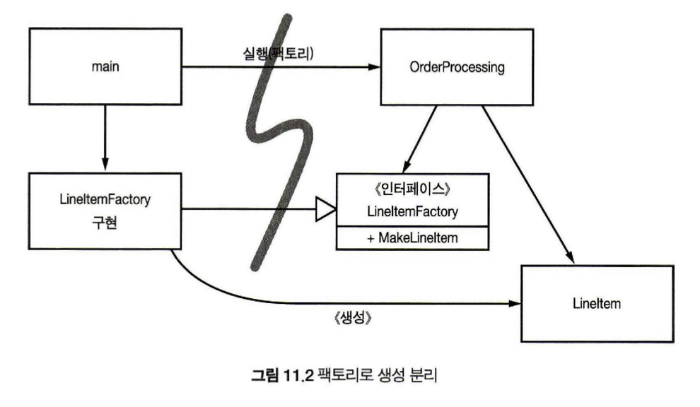
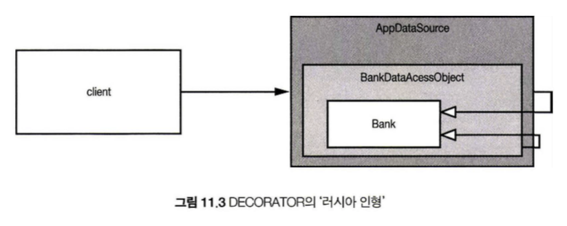

# 11. 시스템

## 목차

1. [도시를 세운다면?](#도시를-세운다면?)
2. [시스템 제작과 시스템 사용을 분리하라](#시스템-제작과-시스템-사용을-분리하라)
3. [확장](#확장)
4. [자바 프록시](#자바-프록시)
5. [순수 자바 AOP 프레임워크](#순수-자바-AOP-프레임워크)
6. [AspectJ 관점](#AspectJ-관점)
7. [테스트 주도 시스템 아키텍쳐 구측](#테스트-주도-시스템-아키텍쳐-구측)
8. [의사 결정을 최적화하라](#의사-결정을-최적화하라)
9. [명백한 가치가 있을 때 표준을 현명하게 사용하라](#명백한-가치가-있을-때-표준을-현명하게-사용하라)
10. [시스템은 도메인 특화 언어가 필요하다](#시스템은-도메인-특화-언어가-필요하다)
11. [결론](#결론)

---

### 도시를 세운다면?

도시가 전력 관리 팀, 수도 관리 팀 등으로 나누어서 관리를 통해 돌아가듯이 시스템 제작 또한 적절한 추상화와 모듈화가 필수다.

<br>

### 시스템 제작과 시스템 사용을 분리하라

#### 관심사 분리  

메서드 안에서 객체를 선언하는 것(lazy initialization 기법)은 런타임 로직 외에도 하나의 책임을 더 가지게 되는 것이므로 SRP를 깨게 됨  
**설정 논리는 일반 실행 논리와 분리**해야 모듈성이 높아짐!!   

* Main 분리  
  

  1. Main 함수 - 시스템에서 필요한 객체를 생성
  2. Main 함수 - 1 에서 생성한 객체를 어플리케이션에 넘김
  3. Application 함수 - 넘겨받은 객체를 사용!  

  이와 같이 시스템을 구성하면 어플리케이션은 설정 논리를 몰라도 됨

* 팩토리  
    객체가 생성되는 시점을 어플리케이션이 결정할 필요가 있을 때 Abstract Factory 패턴을 사용하여 실행 논리와 설정 논리를 분리  

* 의존성 주입   
  사용과 제작을 분리하는 메커니즘으로 제어 역전 기법을 의존성 관리에 적용한 메커니즘  
  일반 실행 로직을 가지는 객체는 의존성 관리 책임을 가지지 않도록 하기 위해 'main' 루틴이나 특수 컨테이너를 사용해 의존성 관리를 함  
  실행 로직 클래스 setter 메서드나 생성자 인수를 제공하여 컨테이너가 이를 통해 의존성을 설정할 수 있도록 해줌  
  컨테이너의 예시 중 가장 유명한 것은 스프링 프레임워크

<br>

### 확장

'처음부터 올바르게' 시스템을 만들 수 있다는 믿음은 미신  
매일 매일 주어진 사용자 스토리에 맞춰 시스템을 조정하고 확정하여 구현해내면 되는 것 -> 반복적이고 점진적인 애자일 방법의 핵심  

* 횡단(cross-cutting) 관심사   
  EJB2 아키텍처는 트랜잭션, 보안, 일부 영속적인 동작은 소스 코드가 아니라 배치 기술자에서 정의  
  영속성(=지속성, 프로세스가 생성했지만 별개로 유지되는 상태의 특징 중 한 가지이며, 별도의 기억 장치에 데이터를 보존하는 것이 목적)과 같은 관심사는 애플리케이션의 자연스러운 객체 경계를 넘나드는 경향이 있음 => 모든 객체가 전반적으로 동일한 방식을 이용하게 만들어야 함  
  원론적으로는 모듈화, 캡슐화 방식으로 영속성 방식 구상, **but!** 현실적으로는 영속성 방식을 구현한 코드가 온갖 객체로 흩어짐  
  이렇게 여러 객체에 동일 관심사가 흩어진 것을 횡단 관심사라고 함  
  
* AOP

<br>

### 자바 프록시

책의 예시 코드에서 나오는 Java Proxy는 InvocationHandler를 상속받는데, 이 InvocationHandler는 프록시에 호출되는 메서드를 구현하는데 사용  
Proxy 방식으로 코드를 짜는 것은 양과 크기를 늘리게 만들어 깨끗한 코드를 작성하기 어렵게 하고, 시스템 단위로 실행 '지점'을 명시하는 메커니즘도 제공하지 않음  
e.g.,  

```java
import java.util.*;
// 은행 추상화
public interface Bank {
	Collection<Account> getAccountsO;
	void setAccounts(Collection<Account> accounts);
}

// Banklmpl.java
import java.util.*;

// 추상화를 위한 POJO("Plain Old Java Object") 구현 
public class Banklmpl implements Bank {
	private List<Account> accounts;
  
	public Collection<Account> getAccounts() { 
    return accounts;
  }
	public void setAccounts(Collection<Account> accounts) { 
    this.accounts = new ArrayList<Account>();
		for (Account account: accounts) {
			this.accounts.add(account);
    }
  }
}

// BankProxyHandler.java
import java.lang.reflect.*;
import java.util.*;

// 프록시 API가 필요한 ''InvocationHandler''
public class BankProxyHandler implements InvocationHandler {
	private Bank bank;
	public BankProxyHandler (Bank bank) { 
    this.bank = bank;
  }

	// InvocationHandler에 정의된 메서드
	public Object invoke(Object proxy, Method method, Object[] args) throws Throwable {
		String methodName = method.getName();
		if (methodName.equals("getAccounts")) {
			bank.setAccounts(getAccountsFromDatabase()));
			return bank.getAccounts();
		} else if (methodName.equals("setAccounts")) {
			bank.setAccounts((Collection<Account>) args[0]);
      setAccountsToDatabase(bank.getAccounts());
			return null;
    } else {
      ...
    }
	}
  
  // 세부사항은 여기에 이어진다.
	protected Collection<Account> getAccountsFromDatabase() { ... }
	protected void setAccountsToDatabase(Collection<Account> accounts) { ... }

  // 다른 곳에 위치하는 코드
	Bank bank = (Bank) = (Bank) Proxy.newProxyInstance(
    Bank.class.getClassLoader(),
    new Class[] { Bank.class },
    new BankProxyHandler(new BankImpl())
  );
```

<br>

### 순수 자바 AOP 프레임워크

**순수 자바**란?   
[AspectJ](#AspectJ-관점)를 사용하지 않는 다는 뜻



<br>

### AspectJ 관점

AspectJ이란?  
PARC에서 개발한 자바 프로그래밍 언어용 관점 분리하여 모듈화 구성을 지원하는 관점 지향 프로그래밍(AOP) 확장 기능

- 최근 AspectJ 애터테이션 폼  
  Java5 애너테이션을 사용해 관점을 정의
- 스프링 프레임워크  
  AspectJ에 미숙한 팀들이 애너테이션 기반 관점을 쉽게 사용하도록 다양한 기능을 제공

<br>

### 테스트 주도 시스템 아키텍쳐 구측

코드 수준에서 아키텍처 관심사를 분리할 수 있다면, 테스트 주도 아키텍처 구축이 가능  
BDUF(Big Design Up Front - 프로그램 구현 시작 전에 디자인이 완성되는 것) 추구는 장점도 있지만 기존의 설계에서 다른 생각을 하기가 어렵다는 단점이 존재  
프로젝트 시작 시 일반적인 범위, 목표 일정, 결과로 내놓을 시스템의 일반적인 구조까지 생각한 후 단순하고 잘 분리된 아키텍처로 소프트웨어 프로젝트를 진행해 결과물을 빨리 출시한 후, 기반 구조를 추가하여 조금씩 확장해 나가는 것이 더 좋을 수도 있음

**요약**  
최선의 시스템 구조 - 모듈화된 관심사 영역을 각각의 객체로 구현하여 서로 다른 영역 코드에 최소한의 영향을 미치는 관점/도구를 사용해 통합  

<br>

### 의사 결정을 최적화하라

모듈을 나누고 관심사를 분리하여 적합한 사람이 해당 모듈을 맡아 가장 최선의 시점(충분한 정보가 모였을 때)에 결정을 내리면 복잡성이 줄어들고 결정을 내리기도 더욱 쉬워짐

<br>

### 명백한 가치가 있을 때 표준을 현명하게 사용하라

표준을 사용하면 아이디어와 컴포넌트를 재사용하기 쉽고, 적절한 경험을 가진 사람을 구하기 쉬우며, 좋은 아이디어를 캡슐화하기 쉬운 등 이점들이 있긴하지만 EJB2와 같이 표준이라는 이유만으로 오버스펙/적합하지 않은 상황임에도 사용하는 일이 없도록 해야 함   
<br>

### 시스템은 도메인 특화 언어가 필요하다

**DSL?**  
간단한 스크립트 언어나 표준 언어로 구현한 API  

**좋은 DSL**

* 도메인 개념과 그 개념을 구현한 코드 사이에 존재하는 **의사소통 간극**을 줄여줌
* 도메인 전문가가 사용하는 언어로 도메인 논리를 구현하면 도메인을 잘못 구현할 가능성이 줄어듦
* 추상화 수준을 코드 관용구나 디자인 패턴 이상으로 끌어올림

<br>

### 결론

깨끗하지 못한 아키텍처는 도메인 논리를 흐리며 기민성을 떨어트림  
**기민성이 떨어지면 생산성이 낮아짐**

시스템을 설계하든 개별 모듈을 설계하든, 실제로 돌아가는 **가장 단순한 수단을 사용**할 것