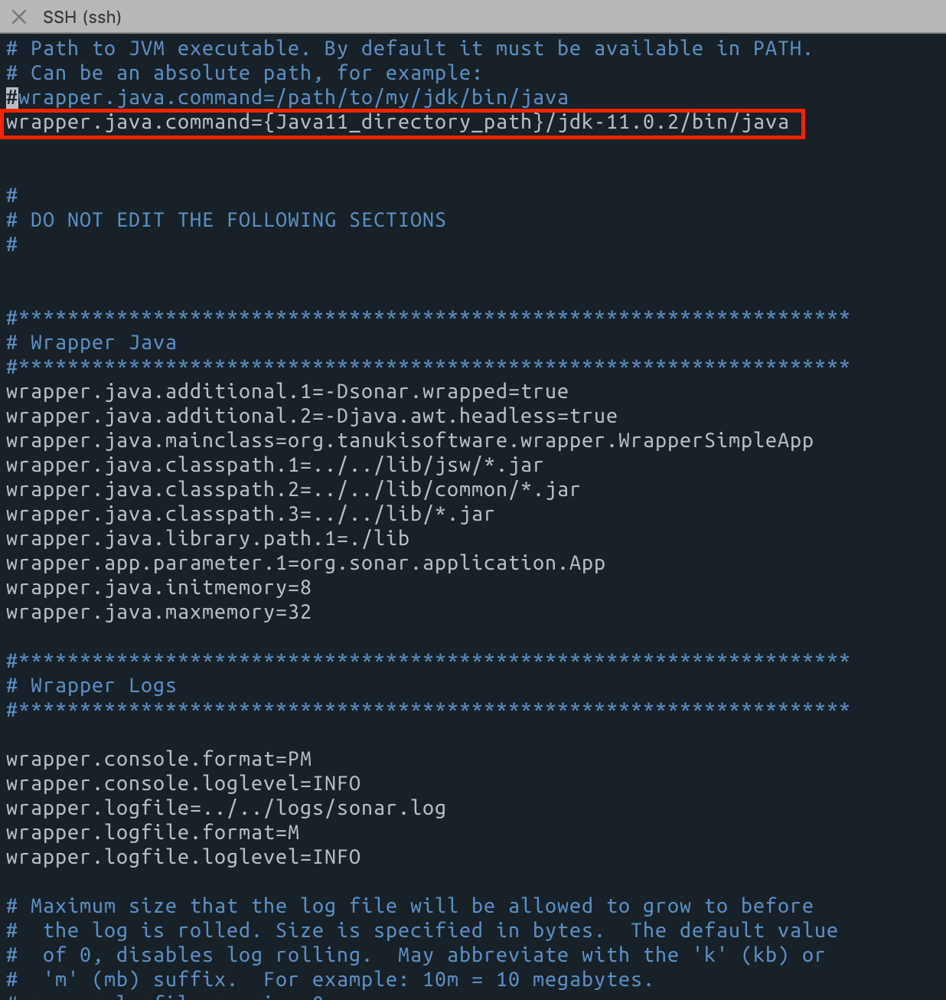

## Trouble Shooting

### Java 버전 Issue

실행 시 아래와 같은 자바 버전 관련 이슈가 있었다.

```bash
WrapperSimpleApp: Encountered an error running main: java.lang.IllegalStateException: SonarQube requires Java 11 to run
java.lang.IllegalStateException: SonarQube requires Java 11 to run
        at com.google.common.base.Preconditions.checkState(Preconditions.java:508)
        at org.sonar.application.App.checkJavaVersion(App.java:94)
        at org.sonar.application.App.start(App.java:57)
        at org.sonar.application.App.main(App.java:98)
        at sun.reflect.NativeMethodAccessorImpl.invoke0(Native Method)
        at sun.reflect.NativeMethodAccessorImpl.invoke(NativeMethodAccessorImpl.java:62)
        at sun.reflect.DelegatingMethodAccessorImpl.invoke(DelegatingMethodAccessorImpl.java:43)
        at java.lang.reflect.Method.invoke(Method.java:498)
        at org.tanukisoftware.wrapper.WrapperSimpleApp.run(WrapperSimpleApp.java:240)
        at java.lang.Thread.run(Thread.java:745)
<-- Wrapper Stopped
```

소나큐브 설치 당시 가장 최신버전인 `sonarqube-8.3.0.34182`을 다운받아서 세팅하는 과정에 발생 한 버그다.  
SonarQube는 내부적으로 검색을 위해 사용하는 ElasticSearch가 Java11 이상의 버전이 필요한데 현재 사용중인 서버에서는 Java8을 사용중이어서 발생하는 이슈이다.  
서버 전체의 자바 버전을 업그레이드 하기에는 서버에서 구동중인 서비스들이 있어서 Java11을 설치 한 뒤 설정파일에서 path를 변경하는 방법으로 이슈를 해결했다.

#### 해결 방법

> 1. Java 11 설치 및 압축 해제
>
>    ```bash
>    $ cd {Java11_directory_path}
>    $ curl -O https://download.java.net/java/GA/jdk11/9/GPL/openjdk-11.0.2_linux-x64_bin.tar.gz
>    $ tar -zxvf openjdk-11.0.2_linux-x64_bin.tar.gz
>    ```
>
> 2. SonarQube 설정 내 Java 경로 변경  
>
>    ```bash
>    $ cd {SonqrQube_path}/sonarqube-8.3.0.34182/conf
>    $ vi wrapper.conf
>    ```
>
>    가장 상단의 wrapper.java.command 값을 `{Java11_directory_path}/jdk-{버전}/bin/java`으로 변경 해 준다.
>
>    

<br>

### Elasticsearch vm.max_map_count 이슈

Elasticseasrch 5.0 이후로 인스턴스 시작 시 bootstrap 체크라는 장치가 도입되어 의도치 않은 설정 실수를 미리 확인할 수 있게 되었다.  
Elasticsearch의 효율성을 위해 max_map_count를 최소 262144로 사용하도록 하는데, 서버 내에서는 해당 값이 65530로 설정되어 있어서 생긴 문제였다.  
이슈 관련 로그

```shell
2020.05.06 18:47:40 INFO  app[][o.s.a.SchedulerImpl] Waiting for Elasticsearch to be up and running
OpenJDK 64-Bit Server VM warning: Option UseConcMarkSweepGC was deprecated in version 9.0 and will likely be removed in a future release.
2020.05.06 18:47:40 INFO  app[][o.e.p.PluginsService] no modules loaded
2020.05.06 18:47:40 INFO  app[][o.e.p.PluginsService] loaded plugin [org.elasticsearch.transport.Netty4Plugin]
ERROR: [2] bootstrap checks failed
[1]: max virtual memory areas vm.max_map_count [65530] is too low, increase to at least [262144]
[2]: system call filters failed to install; check the logs and fix your configuration or disable system call filters at your own risk
2020.05.06 18:47:46 WARN  app[][o.s.a.p.AbstractManagedProcess] Process exited with exit value [es]: 78
2020.05.06 18:47:46 INFO  app[][o.s.a.SchedulerImpl] Process[es] is stopped
2020.05.06 18:47:46 INFO  app[][o.s.a.SchedulerImpl] SonarQube is stopped
<-- Wrapper Stopped
```

#### 해결방법

> ```shell
> $ sysctl -w vm.max_map_count=262144
> $ sysctl vm.max_map_count
> vm.max_map_count = 262144 # 정상적으로 설정된 것 
> ```

<br>

### Elasticsearch 데몬 실행

Elasticsearch를 데몬으로 실행하기 위해 System call filter check 설정이 필요한데 해당 부분에 대한 설정이 없어  bootstrap 에러가 난 것이다.

```shell
2020.06.08 10:57:07 INFO  app[][o.s.a.SchedulerImpl] Waiting for Elasticsearch to be up and running
OpenJDK 64-Bit Server VM warning: Option UseConcMarkSweepGC was deprecated in version 9.0 and will likely be removed in a future release.
2020.06.08 10:57:07 INFO  app[][o.e.p.PluginsService] no modules loaded
2020.06.08 10:57:07 INFO  app[][o.e.p.PluginsService] loaded plugin [org.elasticsearch.transport.Netty4Plugin]
ERROR: [1] bootstrap checks failed

[1]: system call filters failed to install; check the logs and fix your configuration or disable system call filters at your own risk
2020.05.06 18:47:46 WARN  app[][o.s.a.p.AbstractManagedProcess] Process exited with exit value [es]: 78
2020.05.06 18:47:46 INFO  app[][o.s.a.SchedulerImpl] Process[es] is stopped
2020.05.06 18:47:46 INFO  app[][o.s.a.SchedulerImpl] SonarQube is stopped
<-- Wrapper Stopped
```

#### 해결방법

> sonarQube 디렉토리 내에 있는 elasticsearch의 config 파일을 직접 건드리면 안된다고 한다.  
> Sonarqube의 설정파일 중 Elasticsearch이 부분의 주석을 해제하고 아래와 같이 system_call_filer 설정값 부분을 수정해 준다. 
>
> ```shell
> $ cd /path/to/sonarqube
> $ vi conf/sonar.properties
> #--------------------------------------------------------------------------------------------------
> # ELASTICSEARCH
> # Elasticsearch is used to facilitate fast and accurate information retrieval.
> # It is executed in a dedicated Java process. Default heap size is 512MB.
> #
> # --------------------------------------------------
> # Word of caution for Linux users on 64bits systems
> # --------------------------------------------------
> # Please ensure Virtual Memory on your system is correctly configured for Elasticsearch to run properly
> # (see https://www.elastic.co/guide/en/elasticsearch/reference/5.5/vm-max-map-count.html for details).
> #
> # When SonarQube runs standalone, a warning such as the following may appear in logs/es.log:
> #      "max virtual memory areas vm.max_map_count [65530] is too low, increase to at least [262144]"
> # When SonarQube runs as a cluster, however, Elasticsearch will refuse to start.
> #
> 
> # JVM options of Elasticsearch process
> #sonar.search.javaOpts=-Xmx512m -Xms512m -XX:+HeapDumpOnOutOfMemoryError
> 
> # Same as previous property, but allows to not repeat all other settings like -Xmx
> #sonar.search.javaAdditionalOpts=
> sonar.search.javaAdditionalOpts=-Dbootstrap.system_call_filter=false
> 
> # Elasticsearch port. Default is 9001. Use 0 to get a free port.
> # As a security precaution, should be blocked by a firewall and not exposed to the Internet.
> #sonar.search.port=9001
> 
> # Elasticsearch host. The search server will bind this address and the search client will connect to it.
> # Default is loopback address.
> # As a security precaution, should NOT be set to a publicly available address.
> #sonar.search.host=
> 
> ```


