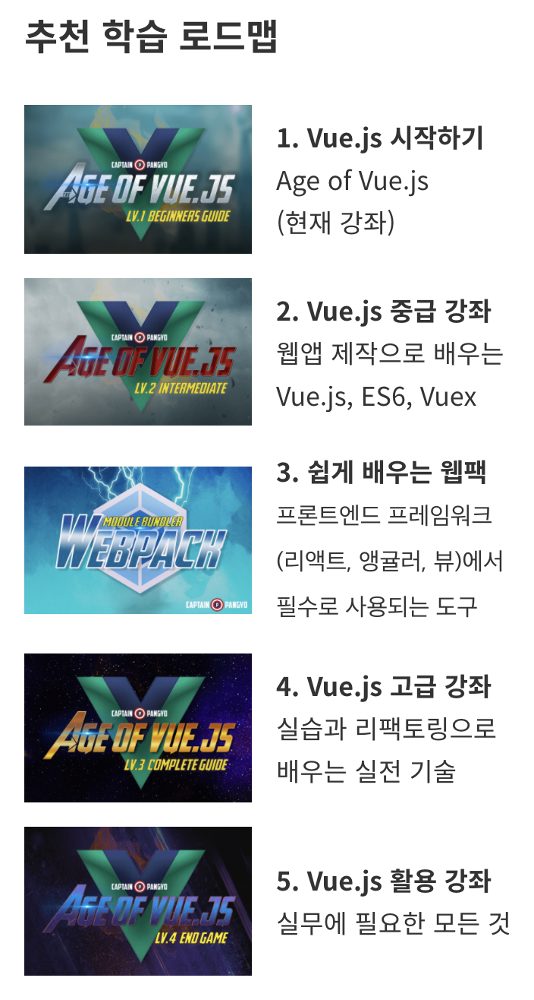

# Inflearn에서 듣는 Vue 강의

업무 중 vue.js를 사용하여 운영툴을 개발하는 프로젝트를 맡게 되었다. 해당 프로젝트의 매니저를 맡으면서 모두 경험이 없는 vue의 템플릿을 개발하는 업무를 맡아 공부가 필요함을 느끼고!! Inflearn의 강의를 찾아보았다.  
가장 인기 많은 강좌들을 살펴보던 중 차근차근 배우기 좋아보였던 강의가 있어 해당 강의의 로드맵을 따라 듣기로 한다.

1. [Vue.js 시작하기](./vue-js-시작하기.md)   
   https://www.inflearn.com/course/Age-of-Vuejs#description

