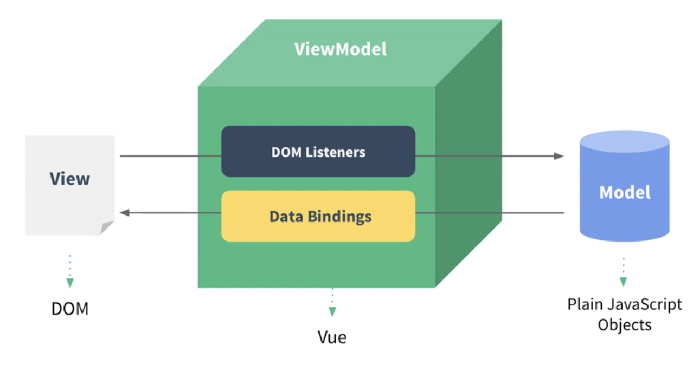
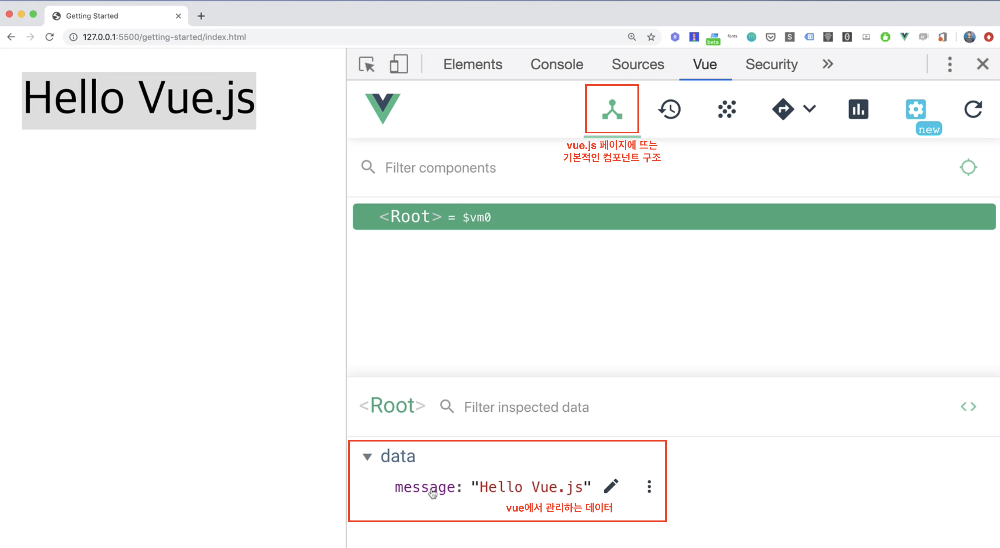
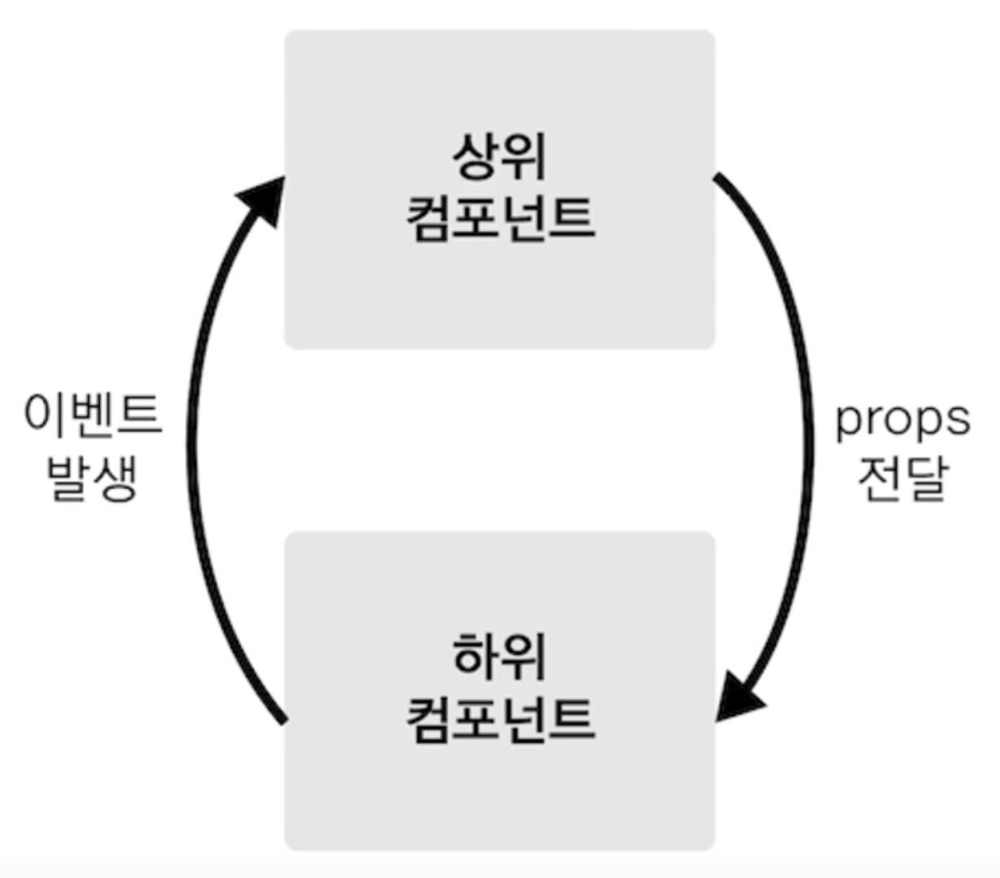
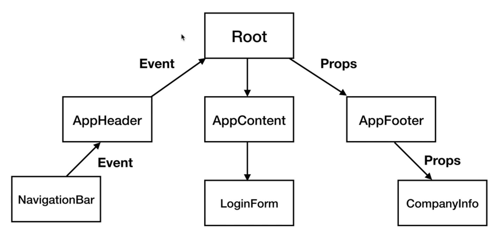
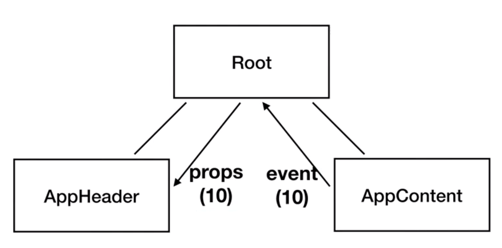
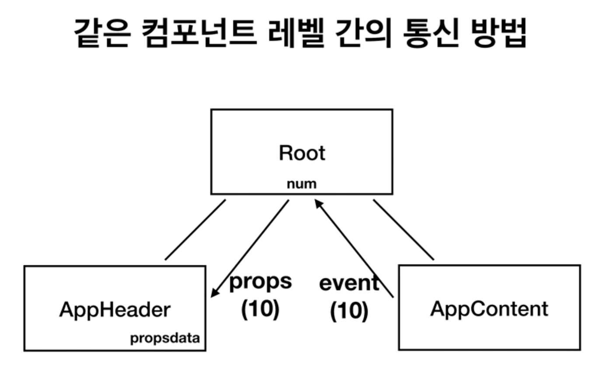

## Vue.js 시작하기

> https://www.inflearn.com/course/Age-of-Vuejs#description  
> 수업을 들으며 정리해놓으면 좋을 부분들을 정리하자📚

<br>

## 개발 환경 설정

### VSCode

```
- Vetur
- Night Owl
- Material Icon Theme
- Live Server
	Html 파일을 수정했을 때 수정 내역을 바로 보기 위해 필요한 플러그인
- ESLint
- Prettier
- Auto Close Tag
- Atom Keymap
```

<br>

## Vue.js 소개

### MVVM 모델에서의 Vue

MVVM 패턴의 뷰모델 레이어에 해당하는 View(화면)단 라이브러리



* View
  * 사용자에게 보여지는 브라우저 화면
  * 화면의 요소인 HTML을 DOM을 이용해 자바스크립트로 조작
* ViewModel
  * DOM Listeners
    * 화면의 버튼 클릭 등의 이벤트 발생 인지
* Model
  * Java Script의 데이터가 바뀌었을 때 View Model의 Data Bindings을 이용해 View에 반영시킴

<br>

### 기존 웹 개발 방식(HTML, JAvascript)

#### VSCode에서 HTML 개발

* 기본 HTML 코드 생성
  * ! + tab
* div 태그의 선택자 
  * div#선택자id

<br>

### Reactivity 구현

웹개발 API 문서가 정리되어 있는 사이트 - https://developer.mozilla.org/ko/

vue.js의 대표적인 개념인 Reactivity 구현을 위해 Object.defineProperty API를 이용해 vue 객체를 선언해야 함

```javascript
Object.defineProperty('대상 객체', 객체의 속성, {
                      정의 할 내용
                      })

var viewModel = {};
Object.defineProperty(viewModel, 'str', {
  // 속성에 접근했을 때의 동작을 정의
  get: function() {
	},
  // 속성에 값을 할당했을 때의 동작을 정의
  set: function (newValue) {
    // 이렇게 설정해주면 값이 할당되면 바로 화면이 바뀜
    div.innerHTML = newValue;
	}
})
```

<br>

### Reactivity 구현

<br>

### Reactivity 코드 라이브러리화 하기

#### 즉시 실행함수

정의되자마자 즉시 실행되는 Javascript Function  

* 어플리케이션 로직에 스크립트 코드가 노출되지 않도록 함
* 변수의 유효범위 관리에 용이

<br>

### Hello Vue.js와 뷰 개발자 도구



<br>

## 인스턴스

### 인스턴스 소개

뷰로 개발할 때 필수로 생성해야 하는 코드

<br>

### 인스턴스와 생성자 함수

생성자 함수로 Vue에서 Api, 함수를 미리 생성해놓고 이후에 그냥 갖다 쓸 수 있음

```javascript
function Vue() {
	this.logText = function() {
    console.log('hello');
  }
}

var vm = new Vue();
vm.logText();
```

<br>

### 인스턴스 옵션 속성

```javascript
// 객체를 변수로 정의하고 객체를 vue model에 넘겨주는 것 보다
var options = {
  el: '#app',
  data: {
    message: 'hi'
  },
  methods: {              
  }
}
var vm = new Vue(options);

// 객체 리터럴로 통째로 넘겨주는 것이 가독성이 더 올라감
var vm = new Vue({
  el: '#app',
  data: {
    message: 'hi'
  },
  methods: {              
  }
});
```

<br>

## 컴포넌트

### 컴포넌트 소개

#### 컴포넌트란?

> 화면의 영역을 구분하여 개발할 수 있는 뷰의 기능  
> 영역을 구분하여 개발하기 때문에 기존의 영역들을 조합하여 새로운 화면을 만드는 등의 재사용성이 올라가고 코드의 반복성이 줄어듦

<br>

### [실습 안내] 컴포넌트 등록 및 실습 & [실습 안내] 전역 컴포넌트 등록

#### 컴포넌트 등록방법

```javascript
Vue.component('컴포넌트 이름', 컴포넌트 내용);
```

e.g.)  

```html
<body>
    <div id="app">
        <app-header></app-header>
        <app-content></app-content>
    </div>

    <script src="https://cdn.jsdelivr.net/npm/vue/dist/vue.js"></script>
    <script>
      	// 화면에 추가할 컴포넌트를 등록
      	// 전역 컴포넌트
        Vue.component('app-header', {
            template: '<h1>Header</h1>'
        });
        Vue.component('app-content', {
            template: '<div>content</div>'
        });

        new Vue({
            el: '#app',
            data: {
                message: 'hi'
            },
            methods: {
            }
        });
        var vm = new Vue(options);
    </script>
</body>
```

<br>

### 지역 컴포넌트 등록

#### 지역 컴포넌트 등록 방식

```javascript
<body>
    <div id="app">
        <컴포넌트 이름></컴포넌트 이름>
    </div>

    <script src="https://cdn.jsdelivr.net/npm/vue/dist/vue.js"></script>
    <script>
        // 전역 컴포넌트 등록방식인 아래 대신 하단의 Vue 인스턴스 내에 정의 해 준다.
        // Vue.component('컴포넌트 이름', 컴포넌트 내용);

        new Vue({
            el: '#app',
            components: {
                '컴포넌트 이름': 컴포넌트 내용
            }
        });
        var vm = new Vue(options);
    </script>
</body>
```

<br>

### 전역 컴포넌트와 지역 컴포넌트의 차이점 & 컴포넌트와 인스턴스와의 관계

* 전역 컴포넌트
  * 플러그인, 라이브러리 형태로 전역으로 사용해야 하는 컴포넌트 일 경우에만 사용
  * 인스턴스를 생성하지 않아도 기본적으로 모든 인스턴스에 등록이 됨
* 지역 컴포넌트
  * 일반적인 컴포넌트 등록 방법
  * 새 인스턴스를 생성 할 때마다 등록해줘야 함

<br>

## 컴포넌트 통신 방법 - 기본

### 컴포넌트 통신

뷰 컴포넌트는 각각 고유한 데이터 유효 범위를 갖음   
각각 고유하게 가진 데이터를 공유하기 위해 props(상위 -> 하위), event(하위 -> 상위) 속성을 이용

<br>

### 컴포넌트 통신 규칙이 필요한 이유

컴포넌트 간에 데이터 이동(props 전달)과 이벤트 발생이 컴포넌트 트리 구조와 상관없이 마구잡이로 발생하게 되면 문제가 생겼을 시 문제의 원인을 찾기가 어려워짐  
데이터는 아래로만 흐르고, 이벤트는 위로만 발생해야 이러한 문제가 발생하지 않음 

<br>

### props 속성

#### props 등록 예시  

```html
<body>
    <div id="app">
      	<!-- 아래의 형식과 같이 v-bind를 이용해 props 속성을 등록 -->
        <!-- <app-header v-bind:프롭스 속성 이름="상위 컴포넌트의 데이터 이름"></app-header> -->
        <app-header v-bind:propsdata="message"></app-header>
    </div>

    <script src="https://cdn.jsdelivr.net/npm/vue/dist/vue.js"></script>
    <script>
        var appHeader = {
            template: '<h1>header</h1>',
            props: ['propsdata']  // props 속성 이름을 등록
        }

        new Vue({
            el: '#app',
            components: {
                'app-header': appHeader
            },
            data: {
                message: 'hi'
            }
        })
    </script>
</body>
```

<br>

### props 속성의 특징

props 속성으로 데이터를 상위 컴포넌트에게 받을 시, 상위 컴포넌트의 데이터 내용이 바뀌면 하위 컴포넌트에서도 데이터가 바뀜

<br>

### event emit

#### event emit 등록 예시

```html
<body>
    <div id="app">
        <!-- <app-header v-on:하위 컴포넌트에서 발생한 이벤트 이름="하위 컴포넌트의 메서드 이름"></app-header> -->
        <app-header v-on:pass="logText"></app-header>
    </div>

    <script src="https://cdn.jsdelivr.net/npm/vue/dist/vue.js"></script>
    <script>
        var appHeader = {
            template: '<button v-on:click="passEvent">click me</button>',
            methods: {
                passEvent: function() {
                    this.$emit('pass');
                }
            }
        }

        new Vue({
             el: '#app',
             components: {
                 'app-header': appHeader
             },
             methods: {
                 logText: function() {
                     console.log('hi');
                 }
             }
        })
    </script>
</body>
```

<br>

## 컴포넌트 통신 방법 - 응용

### 같은 컴포넌트 레벨 간의 통신 방법

아래의 그림 중 AppHeader, AppContent 컴포넌트는 같은 레벨에 존재하므로 상위 -> 하위로 props 속성을 이용해 데이터를 주고받는 방법을 사용할 수 없음  
이러한 경우 어떻게 데이터를 주고받을지 살펴봐야 함  

<br>

### 같은 컴포넌트 레벨 간의 통신 방법 구현 1

같은 레벨의 컴포넌트 간의 데이터 통신은 불가, 대신 상위 컴포넌트를 통해 event, props를 이용해 통신함 

<br>

### 같은 컴포넌트 레벨 간의 통신 방법 구현 2



```html
<body>
    <div id="app">
        <app-header v-bind:propsdata="num"></app-header>
        <app-content v-on:pass="deliverNum"></app-content>
    </div>

    <script src="https://cdn.jsdelivr.net/npm/vue/dist/vue.js"></script>
    <script>
        var appHeader = {
            template: '<div>header</div>',
            props: ['propsdata']
        }
        var appContent = {
            template: '<div>content <button v-on:click="passNum">pass</button></div>',
            methods: {
                passNum: function() {
                    this.$emit('pass', 10);
                } 
            }
        }

        new Vue({
            el: '#app',
            components: {
                'app-header': appHeader,
                'app-content': appContent
            },
            data: {
                num: 0
            },
            methods: {
                deliverNum: function(value) {
                    this.num = value;                  
                }
            }
        })
    </script>
</body>
```

<br>

## 라우터

### 뷰 라우터 소개와 설치

라우터를 사용하기 위해서는 vue를 사용하는 것과 마찬가지로 CDN 방식을 사용

```html
<!-- 순서 중요! -->
<script src="https://cdn.jsdelivr.net/npm/vue/dist/vue.js"></script>
<script src="https://unpkg.com/vue-router/dist/vue-router.js"></script>
```

<br>

### 뷰 라우터 인스턴스 연결 및 초기 상태 안내 & [실습 안내] routes 속성 설명 및 실습 안내

라우터 등록 방법

```html
<body>
    <div id="app"></div>   

    <!-- 순서 중요! -->
    <script src="https://cdn.jsdelivr.net/npm/vue/dist/vue.js"></script>
    <script src="https://unpkg.com/vue-router/dist/vue-router.js"></script>
    <script>
        var router = new VueRouter({

        });

        new Vue({
            el: '#app',
            router: router
        });
    </script>
</body>
```

<br>

### 라우터가 표시되는 영역 및 router-view 태그 설명

```html
<body>
    <div id="app">
        <!-- Vue 인스턴스의 라우터 인스턴스를 연결해야지만 사용할 수 있는 태그 -->
        <!-- 아래 script에서 router 정보로 넘겨 받은 path가 호출되었을 때 해당 path의 페이지가 표시되는 부분 -->
        <router-view></router-view>
    </div>   

    <script src="https://cdn.jsdelivr.net/npm/vue/dist/vue.js"></script>
    <script src="https://unpkg.com/vue-router/dist/vue-router.js"></script>
    <script>
        var LoginComponent = {
            template: '<div>login</div>'
        }

        var router = new VueRouter({
            routes: [
                {
                    path: '/login',
                    component: LoginComponent
                }
            ]
        });

        new Vue({
            el: '#app',
            router: router
        });
    </script>
</body>
```

<br>

### 링크를 이용한 페이지 이동 및 router-link 태그 설명

해당 서비스의 path는 사용자가 모두 일일이 알 수 없으므로 url을 치고 해당 페이지에 접근하기가 어렵다.  
링크를 제공해 사용자가 사용할 수 있도록 해준다.

```html
<body>
    <div id="app">
        <div>
						<!-- to의 값에 이동하고자 하는 페이지 path를 넘겨준다 -->
          	<!-- router-link는 <a> 태그와 같은 역할을 함 -->
            <router-link to="/login">Login</router-link>
        </div>
        <router-view></router-view>
    </div>   

    <!-- 순서 중요! -->
    <script src="https://cdn.jsdelivr.net/npm/vue/dist/vue.js"></script>
    <script src="https://unpkg.com/vue-router/dist/vue-router.js"></script>
    <script>
        var LoginComponent = {
            template: '<div>login</div>'
        }

        var router = new VueRouter({
            routes: [
                {
                    path: '/login',
                    component: LoginComponent
                }
            ]
        });

        new Vue({
            el: '#app',
            router: router
        });
    </script>
</body>
```

<br>

## HTTP 통신 라이브러리 - axios

### Axios 소개 및 오픈 소스를 사용하기 전에 알아야 할 것들

#### Axios 란?

Vue에서 권고하는 HTTP 통신 라이브러리  
Promise 기반의 HTTP 통신 라이브러리 

#### 자바스크립트의 비동기 처리 패턴

1. callback
2. promise
3. promise + generator
4. async & await

<br>

### Axios 실습 및 this 설명

#### Axios의 response

config + data + headers + request + status + statusText

<br>

### 웹 서비스에서의 클라이언트와 서버와의 HTTP 통신 구조

<br>

### 크롬 개발자 도구 네트워크 패널 보는 방법

- Header  패널
  - 실제 해당 사이트에 대한 요청과 응답 데이터를 확인
- Response 패널
  - 응답 받은 내용을 상세하게 조회하는 패널
- Preview 패널
  - 실제 Response를 좀 더 보기 편하게 해줌

참고 - Http 통신 관련 정보  
https://joshua1988.github.io/web-development/http-part1/

<br>

## 템플릿 문법 - 기본

### 템플릿 문법 소개

템플릿 문법이란?  
뷰로 화면을 조작하는 방법  
데이터 바인딩과 디렉티브로 나뉨

* 데이터 바인딩

  * 뷰 인스턴스에서 정의한 속성들을 화면에 표시하는 방법  

    ```html
    <body>
    	<div>{{ message }}</div>
    	<script>
      	new Vue({
        	data: {
          	message: 'Hello Vue.js'
    	    }
      	})
    	</script>
    </body>
    ```

* 디렉티브

  * Html 태그에서 일반적인 id, class와 같은 표준 속성을 제외하고 `v- `가 붙어있는 속성들로 vue가 인식하여 내부적으로 조작

    ```html
    <div>
      Hello <span v-if="show">Vue.js</span>
    </div>
    ```

<br>

### 데이터 바인딩과 computed 속성

#### Computed  속성이란

다른 속성에 의해 변경 될 수 있는 속성에 대한 정의   

```html
<body>
    <div id="app">
      	<!-- 아래의 id 속성이 변경될 수 있으므로 Vue의 data에 정의하여 reactive 하게 처리 -->
        <!-- <p id='abc1234'>{{ num }}</p> -->
        <p v-bind:id="uuid">{{ num }}</p>
	      <!-- doubleNum 값은 num에 의해 변하는 값 -->
        <p>{{ doubleNum }}</p>
    </div>

    <script src="https://cdn.jsdelivr.net/npm/vue/dist/vue.js"></script>
    <script>
        new Vue({
            el: '#app',
            data:  {
                num: 10,
                uuid: 'abc1234'
            },
            computed: {
                doubleNum: function() {
                    return this.num * 2;
                }
            }
        })
    </script>
</body>
```

<br>

### methods 속성과 v-on 디렉티브를 이용한 키보드, 마우스 이벤트 처리 방법

```html
<!DOCTYPE html>
<html lang="en">
<head>
    <meta charset="UTF-8">
    <meta name="viewport" content="width=device-width, initial-scale=1.0">
    <title>Document</title>
</head>
<body>
   <div id="app">
     <!-- 아래와 같이 v-on 속성을 이용해 키보드 입력, 마우스 이벤트에 따른 처리 설정이 가능 -->
       <button v-on:click="logText">click me</button>
       <input type="text" v-on:keyup.enter="logText"> 
       <button>add</button>
   </div> 

   <script src="https://cdn.jsdelivr.net/npm/vue/dist/vue.js"></script>
   <script>
       new Vue({
           el: '#app',
           methods: {
               logText: function() {
                   console.log('clicked');
               }
           }
       })
   </script>
</body>
</html>
```

<br>

## 템플릿 문법 - 실전

### watch 속성

데이터를 대상으로 설정할 수 있는 속성으로, 데이터의 변화에 따라 특정 로직을 실행시킬 수 있는 Vue의 속성

```javascript
new Vue({
  el: '#app',
  data: {
    num: 10
  },
  watch: { // num 데이터의 변화에 따라서 특정 로직을 실행
    num: function() {
      this.logText();
    }
  },
  methods: {
    addNum: function() {
      this.num = this.num + 1;
    },
    logText: function() {
      console.log('changed');                
    }
	}
})
```

<br>

### watch 속성 vs computed 속성

* watch
  * 좀 더 무거운 로직 (매번 실행되기 어려운 로직 e.g. 데이터 요청)
* computed
  * 단순한 값에 대한 계산
  * 단순한 text의 입력을 받아 validation 값을 계산

<br>

## 프로젝트 생성 도구 - Vue CLI

### CLI 2.x와 3.x의 차이점 / 프로젝트 생성 및 서버 실행

```bash
# Vue CLI 2.x
vue init '프로젝트 템플릿 유형' '프로젝트 폴더 위치'
# 예시
vue init 'webpack-simple' '프로젝트 폴더 위치'

# Vue CLI 3.x
vue create '프로젝트 위치'
vue create vue-cli
```

<br>

### CLI로 생성한 프로젝트 폴더 구조 확인 및 main.js 파일 설명

```
├── public
│   ├── favicon.ico
│   └── index.html  -> src 디렉토리 하위의 vue 파일에 대한 의존성을 정의
├── src
│   ├── App.vue
│   ├── assets
│   │   └── logo.png
│   ├── components
│   │   └── HelloWorld.vue
│   └── main.js
└── yarn.lock

```

<br>

### 싱글 파일 컴포넌트 소개 및 여태까지 배운 내용 적용하는 방법 & App.vue와 HelloWorld.vue 설명

```html
var appHeader = {
    // 하단의 template 태그 안에 들어갈 부분
    template: '<div>header</div>',
    // 하단의 script 태그 안의 export default 안의 method 속성 안에 들어갈 부분
    methods: {
        addNum: function() {

        }
    }
}

<template>
    <div>header</div>
</template>

<script>
export default {
    methods: {
        addNum: function() {
        }
    }
}
</script>

<style>

</style>
```

