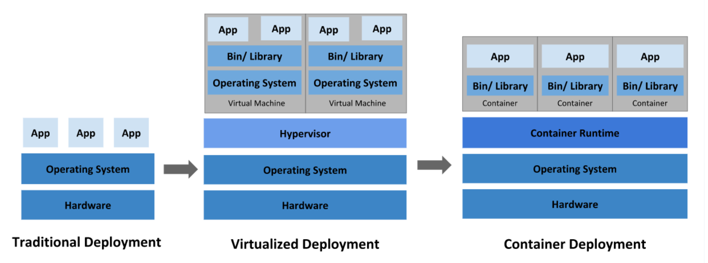

# 데브옵스(DevOps)를 위한 쿠버네티스 마스터

## 전통적인 방식, 온프레미스 환경 이해와 단점

---

## 마이크로서비스를 구현하는 도커와 쿠버네티스

### 마이크로서비스

* 장점
  * 서비스 단위의 빠른 개발 
  * 배포 용이 : 서비스 단위로 개발, 패키징, 빌드, 테스트, 배포
  * Scale-Out 구조
* 단점
  * 여러대의 서비스를 운영하게 되므로 Transaction 보장, 테스트, 배포, 관리가  복잡

### 이미지, 컨테이너, 도커와 쿠버네티스

- **컨테이너**
  - 환경을 격리시키는 역할
    기존 VM 과 비교해 매우 적은 양의 리소스만 필요
- **도커**
  - 다수의 컨테이너를 다루며 각각의 컨테이너를 편리하게 관리하도록 도와주는 서비스
- **쿠버네티스**
  - 다수의 도커를 편리하게 관리하도록 도와주는 서비스

 

## 네이티브, 컨테이너와 VM 성능 비교

- 컨테이너는 가상머신을 사용해 각 마이크로 서비스를 격리하는 기술
- 하드웨어를 전부 구현하지 않기 때문에 빠른 실행 가능

  

### 컨테이너를 격리하는 기술

리눅스 커널에 있는 기능 중 네임 스페이스, 컨트롤 그룹 두 기술을 합쳐서 구현

- 네임 스페이스
  - 각 프로세스가 파일 시스템 마운트, 네트워크, uid, uts(호스트 네임) 등에 대해 시스템에 독립 뷰를 제공
- 컨트롤 그룹
  - 프로세스로 소비할 수 있는 리소스 양(CPU, 메모리, I/O, 네트워크 대역대, device 노드 등)을 제한

 

## 도커와 쿠버네티스 소개

### 도커

- 컨테이너 기술을 지원하는 프로젝트 중 하나
- 애플리케이션에 국한되지 않고 의존성 및 파일 시스템까지 패키징하여 빌드, 배포, 실행을 단순화
- 한계
  - 서비스가 커질 수록 관리해야 하는 컨테이너가 급격히 증가하고 관리가 어려움

### 쿠버네티스

- 다수의 컨테이너를 자동으로 운영하기 위한 오케스트레이션 도구
- 많은 시스템을 통합, 컨테이너를 다루기 위한 API 제공